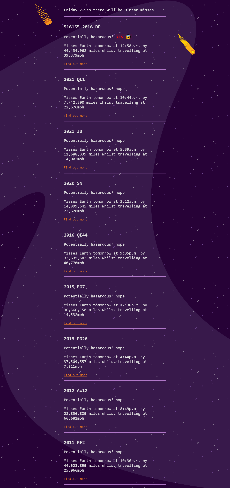

# Will it miss

 Projeto de estudo de caso para entender o encadeamento completo de ferramentas de desenvolvimento web do lado do cliente.

## Screenshot

 

## Links

 - Solution URL: [Repository Project]()
 - Live Site URL: [Live Result]()

### Built with

- Semantic HTML5 markup
- CSS custom properties
- Flexbox
- JavaScript Programming Language
- API DOM JS
- API NASA -[API](https://api.nasa.gov/)

### Tools

- JSX - [extension language](https://reactjs.org/docs/introducing-jsx.html) 
- React - [Framework](https://reactjs.org/)
- Prettier - [Format Code](https://prettier.io/)
- ESLint - [Linting Code](https://eslint.org/)
- PostCSS - [postcss](https://postcss.org/)
- Parcel - [build](https://parceljs.org/)
- Git and GitHub - [VCS](https://developer.mozilla.org/en-US/docs/Learn/Tools_and_testing/GitHub)
- Netlify - [Deployment](https://www.netlify.com/)

### Instale as dependencias

- acesse a pasta /(Raiz) do projeto pelo seu terminal

- e digite o seguinte:

```
$ npm install
```

- para executar o servidor parcel, entre na pasta ```/src``` e digite:

```
$ npx parcel src/index.html
```
